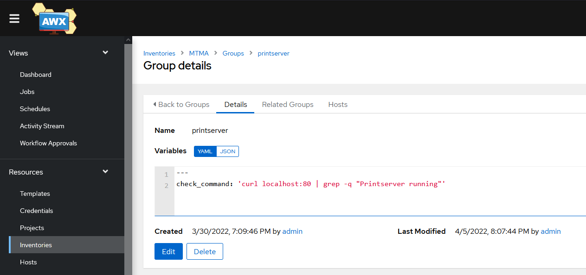
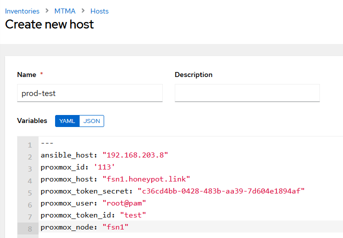
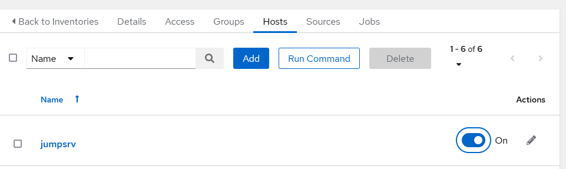
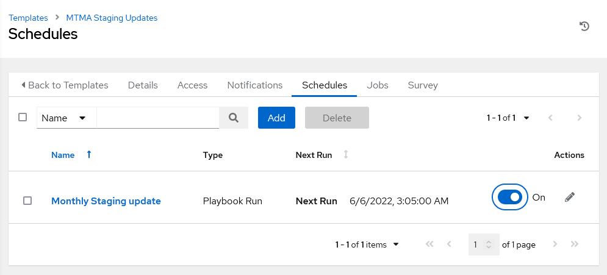
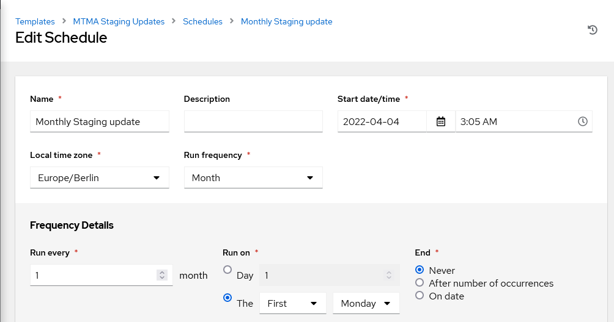
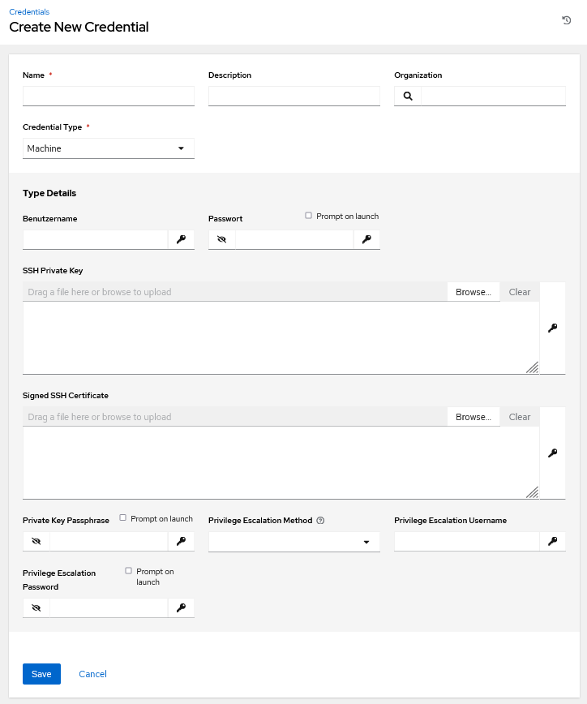
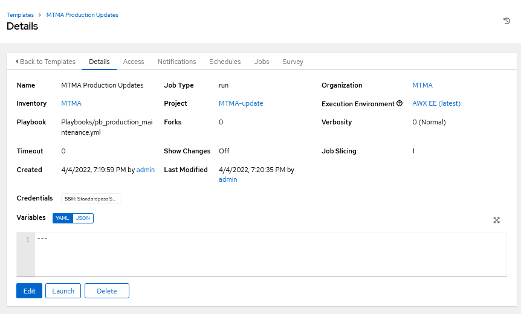
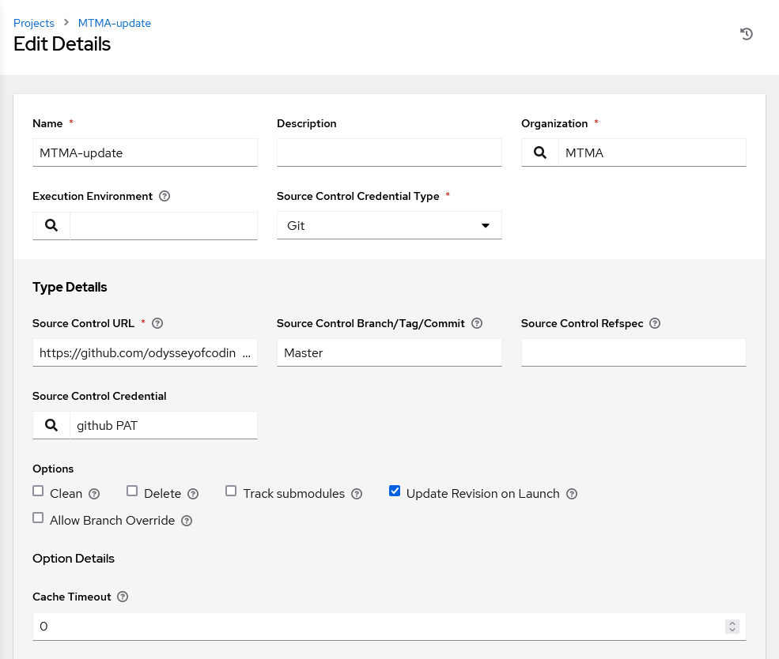
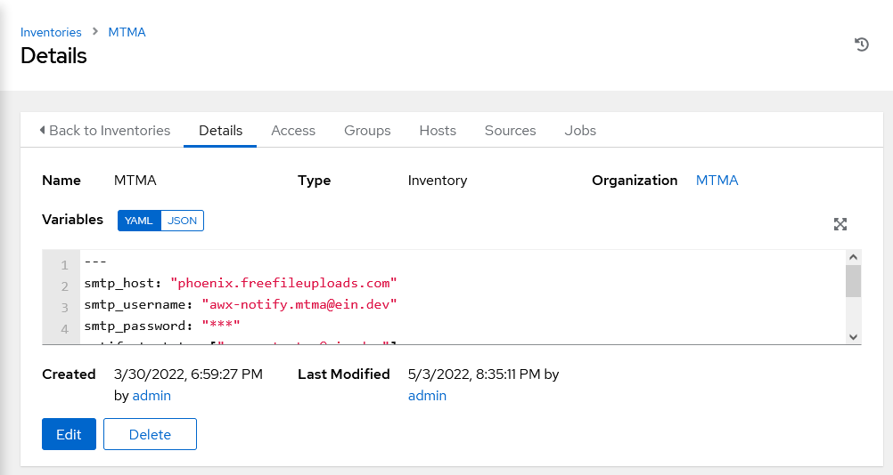

# Administrationshandbuch


## Einleitung
Die MTMA GmbH nutzt Ansible-Playbooks zur Automatisierung der Wartungen.
Dabei wird zwischen Produktions- und Staging-Umgebung unterschieden.
Die Staging-Umgebung wird in regelmäßigen Abständen aktualisiert.
In der Staging-Umgebung kann das Update dann getestet werden und im Fehlerfall ein fehlerhaftes Update in der Produktionsumgebung so vermieden werden.

Nach jeder Wartung wird ein Check ausgeführt, der die Basisfunktionalität überprüfen soll.
Wenn dieser Check nicht erfolgreich ist, wird ein Admin benachrichtigt (siehe [Benachrichtigungs-Mail ändern](#Benachrichtigungs-Mail-ändern))
und ein Snapshot vor der Wartung wiederhergestellt.

Dazu wird das Playbook in einem Github-Repository gespeichert, von wo es vor jedem Update frisch geklont wird.
Damit der Ablauf reibungslos funktioniert wird ein Ansible AWX-Controller eingesetzt,
der intern mit einer PostgreSQL-Datenbank kommuniziert.
Dieser Server verbindet sich über einen Jumphost per SSH auf die verschiedenen Server.

> **Info:**
> Ein Jumphost ist aus technischen Gründen **notwendig**, da vor den Updates Snapshots in Proxmox gemacht werden.
> Dafür ist eine Softwareabhängigkeit nötig, die in Ansible AWX nicht gegeben ist.

## Inhaltverzeichnis
1. [Host hinzufügen](#Host-hinzufügen)
   1. [(opt.) Hostgruppe hinzufügen](#Hostgruppe-hinzufügen)
      1. [Check(s) definieren](#Checks-definieren)
   2. [Host anlegen und Hostgruppe bestimmen](#Host-anlegen-und-Hostgruppe-bestimmen)
2. [Host entfernen](#Host-entfernen)
3. [Fehlgeschlagene Wartung](#Fehlgeschlagene-Wartung)
   1. [Prod-Wartung anhalten](#Prod-Wartung-anhalten)
   2. [Wartung prüfen](#Wartung-prüfen)
4. [Wartungs-Zeitplan ändern](#Wartungs-Zeitplan-ändern)
5. [Funktionales Erweitern vom Playbook](#Funktionales-Erweitern-vom-Playbook)
6. [Update von Ansible/AWX](#Update-von-AnsibleAWX)
7. [Neue Credentials hinzufügen](#Neue-Credentials-hinzufügen)
8. [Benachrichtigungs-Mail ändern](#Benachrichtigungs-Mail-ändern)


## Host hinzufügen
Bevor ein Host hinzugefügt wird, sollte geprüft werden ob eine Hostgruppe angelegt werden muss.

### Hostgruppe hinzufügen
Die Hostgruppen findet man unter `Inventories > MTMA > Groups`.



#### Check(s) definieren
Jede Hostgruppe muss definieren, wie die Server nach der Wartung überprüft werden sollen.
Dies erfolgt mit einem Shell-Befehl in den `Variables`:
````yaml
---
check_command: 'curl localhost:80 | grep -q "Printserver running"'
````
> **Tipp:**
> Es gibt nur 1 Variable für den Check, man kann aber mehrere Checks z.B. mit `check 1 && check 2` kombinieren

### Host anlegen und Hostgruppe bestimmen
Um den neuen Host automatisch dem richtigen Inventory zuzuweisen, ist es zu empfehlen den Host im Inventory zu erstellen.
Das geht über `Inventories > MTMA > Hosts > Add`.

Damit das Playbook korrekt funktioniert, sind folgende Variablen notwendig:
````yaml
---
ansible_host: "192.168.203.8" # IP-Adresse, unter der die VM intern erreichbar ist
proxmox_id: '113' # ID der VM in Proxmox (für Snapshot-Erstellung)

# Zugangsdaten für den Virtualisierungshost (für Snapshot-Erstellung)
proxmox_host: "fsn1.honeypot.link"
proxmox_token_secret: "c36cd4bb-0428-483b-aa39-7d604e1894af"
proxmox_user: "root@pam"
proxmox_token_id: "test"
proxmox_node: "fsn1"
````
Danach kann dem frisch erstellen Host unter `Groups` die korrekte Hostgruppe zugewiesen werden.
Zusätzlich muss dem Host entweder die Hostgruppe `staging` oder `production` zugewiesen werden.

> **WARNUNG:**
> Wenn einem Host nicht beiden Hostgruppen zugewiesen wird, wird er auch nicht vollständig gewartet.
> Was genau in dem Fall passiert kann je nach Hostgruppe unterschiedlich ausfallen.
> Einen Fehlerfall sollte das jedoch nicht auslösen.

## Host entfernen
Um einen Host nicht mehr zu aktualisieren, reicht es den Host im Inventory (`Inventories > MTMA > Hosts`) zu deaktivieren.


## Fehlgeschlagene Wartung
Wenn eine Wartung in der Staging-Umbegung fehlschlägt, sollte sofort das Produktions-Update angehalten werden.

### Prod-Wartung anhalten
Dies geschieht über `Templates > MTMA Production Updates > Schedules`.
Dort sieht man den Zeitplan für die Wartungen in der Produktionsumgebung und kann diese auch anhalten.


### Wartung prüfen
Nun sollte genau geprüft werden, warum die Wartung fehlgeschlagen ist.
Sollte die Überprüfung länger dauern, kann der Zeitplan für die Staging-Wartung ebenfalls
über diesen Weg deaktiviert werden.
Wenn klar ist, dass die Wartung auch in der Produktionsumgebung für keine Probleme sorgt,
kann der Zeitplan wieder aktiviert werden.

## Wartungs-Zeitplan ändern
Sollte sich der gewünschte Zeitplan ändern, kann dies problemlos über `Templates > MTMA Production Updates > Schedules`
bzw. `Templates > MTMA Staging Updates > Schedules` für die Produktions- bzw. Staging-Umgebung geändert werden.


## Funktionales Erweitern vom Playbook
Sollte das Playbook jemals um andere Wartungsaufgaben erweitert werden, ist das problemlos über eine Änderung in GitHub möglich.
Dabei ist zu beachten, dass es 2 Playbooks für beide Umgebungen gibt.
Das Playbook für die Staging-Umgebung übernimmt aber teilweise auch Aufgaben in der Produktionsumgebung,
die aber auf die Funktionaltät keine Auswirkung haben.
Sollte sich der Name der GitHub-Repository geändert haben, muss das Projekt entsprechend angepasst werden:


## Update von Ansible/AWX
Um alle zukünftigen Fälle und Szenarios zu beachten wird empfohlen die Update-Prozeduren des Herstellers zu befolgen: [https://github.com/ansible/awx-operator#upgrading](https://github.com/ansible/awx-operator#upgrading)

## Neue Credentials hinzufügen
Die Zugangsdaten werden zu einem bestimmten Job Template zugeordnet, der sich in einem Projekt befindet. Der Job Template nutzt diese Zugangsdaten für den SSH Zugriff auf die Server.
Der Wartungsuser soll in der Sudo Gruppe aufgenommen sein. Die Zugangsdaten können unter `Credentials` hinzugefügt werden.



Nach dem Hinzufügen der Zugangsdaten sollen diese zu einem Job Template zugeordnet werden. Diese kann unter `Templates > <Templatename> > Detailts > Credentials` zugeordnet werden.



## Benachrichtigungs-Mail ändern
Wenn eine Aufgabe des Playbook oder mehrere fehlschlagen, dann wird eine vordefinierte Mail-Adresse benachrichtigt. Diese Mail, die gesendet wird, enthält alle Debugging Level Informationen und die geworfenen Exceptions über das gesamte Ausführen des Playbook.
Die Empfängeradresse sowie die SMTP Zugangsdaten können unter`Inventories > MTMA Detailsgeändet` werden.


````yaml
---
smtp_host: "phoenix.freefileuploads.com" #SMTP Server
smtp_username: "awx-notify.mtma@ein.dev" #SMTP Username                      
smtp_password: "**********"  #SMTP User Password                                
notify_test_to: ["support.mtma@ein.dev"]  #Empfängeradresse                         
notify_from: "MTMA awx notification <awx-notify.mtma@ein.dev>" #Mail-Betreff und Absenderadresse
ansible_become: true #Mit Root Rechte ausführen                                         
ansible_become_method: sudo #Mit Root Rechte ausführen
````